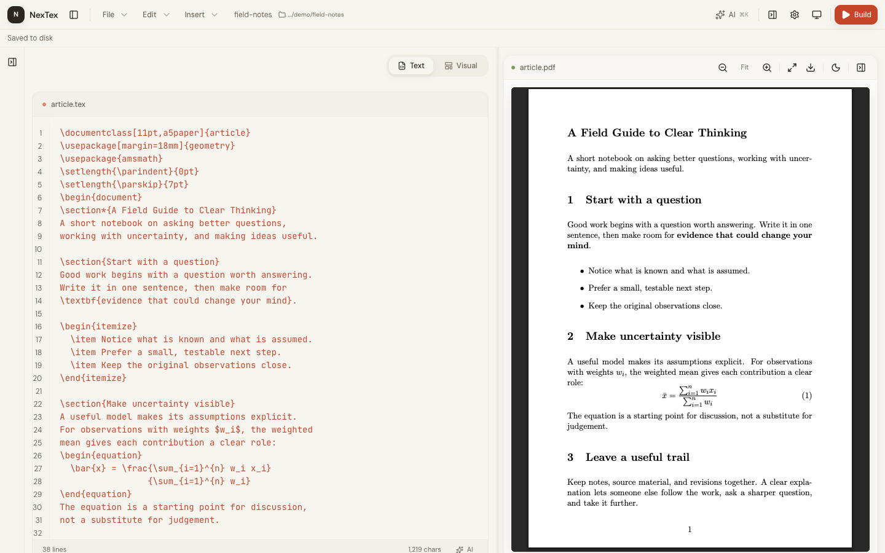
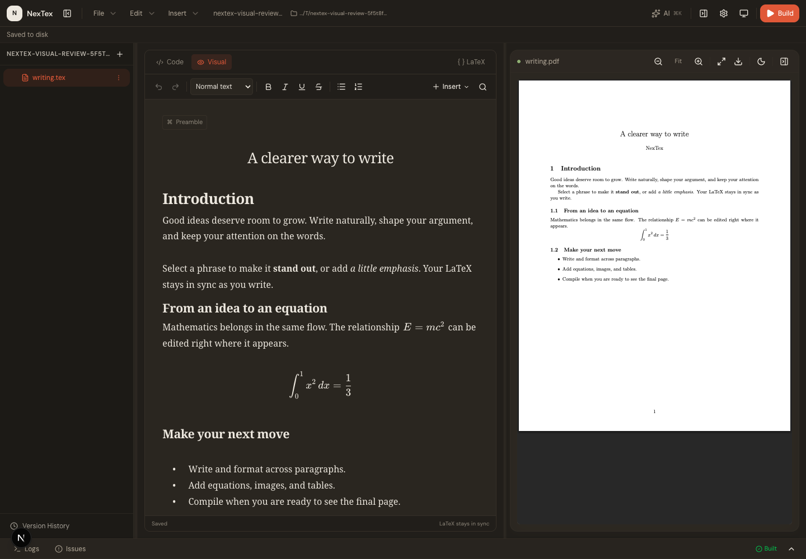

# NexTex

A local LaTeX editor with visual editing, source code, and PDF preview in one workspace.



- Write continuously in Visual mode with formatting, equations, images, and tables.
- Switch to LaTeX source anytime, with shared undo/redo.
- Build PDFs with pdfLaTeX, XeLaTeX, or LuaLaTeX.
- Manage local files, start from templates, and recover drafts or earlier versions.
- Review AI suggestions before applying them. AI is optional and needs your own provider.
- Connect agents through MCP to edit documents, manage files, and build PDFs.



## Get started

Requires **Node.js 22.12+**, **Python 3.10+**, and a local **TeX distribution** such as MacTeX or TeX Live. Install `latexmk` for multipass builds.

```bash
git clone https://github.com/Kyojur0/NexTex.git
cd NexTex
npm run setup
npm run dev
```

Open [localhost:3000](http://127.0.0.1:3000). Use **File → Open Folder** to choose your workspace. Compile trusted LaTeX sources.

For production: `npm run build` then `npm start`. Run checks with `npm run check`.

[Usage & AI setup](docs/usage.md) · [Agent / MCP setup](docs/mcp.md) · [Architecture](frontend/IMPLEMENTATION_SUMMARY.md) · [Backend](backend/README.md)
